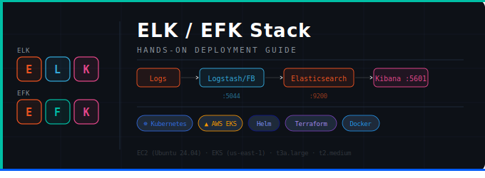

<div align="center">

  <!-- Background -->
  <rect width="900" height="220" fill="url(#bg)" rx="12"/>

  <!-- Grid lines -->
  <line x1="0" y1="55" x2="900" y2="55" stroke="#ffffff08" stroke-width="1"/>
  <line x1="0" y1="110" x2="900" y2="110" stroke="#ffffff08" stroke-width="1"/>
  <line x1="0" y1="165" x2="900" y2="165" stroke="#ffffff08" stroke-width="1"/>
  <line x1="225" y1="0" x2="225" y2="220" stroke="#ffffff08" stroke-width="1"/>
  <line x1="450" y1="0" x2="450" y2="220" stroke="#ffffff08" stroke-width="1"/>
  <line x1="675" y1="0" x2="675" y2="220" stroke="#ffffff08" stroke-width="1"/>

  <!-- Accent line top -->
  <rect x="0" y="0" width="900" height="4" fill="url(#accent)" rx="2"/>

  <!-- Decorative circles -->
  <circle cx="820" cy="170" r="60" fill="#005cf710" stroke="#005cf720" stroke-width="1"/>
  <circle cx="820" cy="170" r="35" fill="#005cf710" stroke="#005cf730" stroke-width="1"/>
  <circle cx="80"  cy="50"  r="40" fill="#00bfa510" stroke="#00bfa520" stroke-width="1"/>

# ELK / EFK Stack — Hands-on Deployment Guide

[](https://www.elastic.co/elasticsearch/)
[](https://www.elastic.co/kibana/)
[](https://www.elastic.co/logstash/)
[](https://helm.sh/)
[](https://aws.amazon.com/eks/)
[](https://www.terraform.io/)

</div>

---

## 📋 Overview

This repository contains hands-on guides and infrastructure-as-code for deploying and operating the **ELK Stack** (Elasticsearch, Logstash, Kibana) and **EFK Stack** (Elasticsearch, Filebeat, Kibana) in two environments:

| Lab            | Environment                  | Tooling                   |
| -------------- | ---------------------------- | ------------------------- |
| **ELK on EC2** | Single Ubuntu 24.04 instance | Manual setup + Metricbeat |
| **EFK on EKS** | Amazon EKS cluster           | Helm, eksctl, EBS CSI     |

Both labs are designed as step-by-step educational guides covering installation, configuration, and practical log monitoring.

---

## 🗂️ Repository Structure

```
.
├── elk-stack-kurulum.md          # ELK Stack setup on Ubuntu EC2 (Turkish)
├── efk-stack-eks-helm.md         # EFK Stack on EKS via Helm (Turkish)
├── README.md                     # This file
├── apachedailyacceslog.txt       # Sample Apache access log for testing
├── php_apache.yaml               # PHP Apache app — Kubernetes Deployment & Service
├── to_do.yaml                    # To-Do app (MongoDB + Node.js) — full K8s manifests
├── elk_with_large_instane.tf     # Terraform: ELK on a single large EC2 instance
└── elk_with_eks.tf               # Terraform: ELK on EKS cluster
```

---

## 🧱 Stack Components

### ELK Stack

| Component         | Role                                                         | Default Port |
| ----------------- | ------------------------------------------------------------ | ------------ |
| **Elasticsearch** | Distributed search & analytics engine (data store)           | `9200`       |
| **Logstash**      | Data pipeline: collect → transform → ship to Elasticsearch   | `5044`       |
| **Kibana**        | Web UI for visualization, dashboards, and log search         | `5601`       |
| **Metricbeat**    | Lightweight agent that ships system metrics to Elasticsearch | —            |

### EFK Stack (Kubernetes-native)

| Component         | Role                                            | Default Port |
| ----------------- | ----------------------------------------------- | ------------ |
| **Elasticsearch** | Same as above                                   | `9200`       |
| **Filebeat**      | DaemonSet-based log shipper for Kubernetes pods | —            |
| **Kibana**        | Same as above                                   | `5601`       |

> **ELK vs EFK:** EFK replaces Logstash with the lighter-weight Filebeat, making it better suited for Kubernetes environments where each node runs a log-collecting agent.

---

## 🚀 Lab 1 — ELK Stack on Ubuntu EC2

**Guide:** [`elk-stack-kurulum.md`](./elk-stack-kurulum.md)

### Prerequisites

- AWS EC2 instance: **Ubuntu 24.04 LTS**, `t3a.large` (min), 16 GB storage
- Security Group ports open: `22`, `5601`, `9200`, `9100`

### Quick Steps

```bash
# 1. Install Java (required by Elasticsearch & Logstash)
sudo apt-get install default-jre

# 2. Add Elastic GPG key and repository
wget -qO - https://artifacts.elastic.co/GPG-KEY-elasticsearch \
  | sudo gpg --dearmor -o /usr/share/keyrings/elasticsearch-keyring.gpg

echo "deb [signed-by=/usr/share/keyrings/elasticsearch-keyring.gpg] \
  https://artifacts.elastic.co/packages/8.x/apt stable main" \
  | sudo tee /etc/apt/sources.list.d/elastic-8.x.list

sudo apt-get update

# 3. Install components
sudo apt-get install elasticsearch logstash kibana metricbeat

# 4. Start & enable all services
sudo systemctl enable --now elasticsearch logstash kibana metricbeat

# 5. Verify Elasticsearch
curl http://localhost:9200
```

### Key Configuration Files

| File                                   | Purpose                                    |
| -------------------------------------- | ------------------------------------------ |
| `/etc/elasticsearch/elasticsearch.yml` | Node name, network host, security settings |
| `/etc/elasticsearch/jvm.options`       | Heap size (`-Xms4g -Xmx4g` for 8 GB RAM)   |
| `/etc/logstash/conf.d/apache-01.conf`  | Logstash pipeline (input → output)         |
| `/etc/kibana/kibana.yml`               | Server host, Elasticsearch URL             |

### Architecture

```
Log Sources
  ├── /home/test_log.log  (Apache access log)
  └── System metrics      (Metricbeat)
          │
          ▼
      Logstash  (input → filter → output)
      Metricbeat (lightweight agent)
          │
          ▼
      Elasticsearch  :9200  (stores & indexes JSON documents)
          │
          ▼
      Kibana  :5601  (dashboards, visualizations, log search)
```

---

## ☸️ Lab 2 — EFK Stack on Amazon EKS with Helm

**Guide:** [`efk-stack-eks-helm.md`](./efk-stack-eks-helm.md)

### Prerequisites

- AWS account with appropriate IAM permissions
- EC2 management node: **Amazon Linux 2023**, `t2.micro`
- Tools: `kubectl`, `eksctl`, `helm`, `aws cli`

### Cluster Setup

```bash
# Create EKS cluster
eksctl create cluster \
  --name mycluster \
  --region us-east-1 \
  --zones us-east-1a,us-east-1b,us-east-1c \
  --node-type t2.medium \
  --nodes 2 --nodes-min 1 --nodes-max 2 \
  --version 1.30 \
  --managed

# Install EBS CSI driver (required for persistent storage)
eksctl create iamserviceaccount \
  --region us-east-1 \
  --name ebs-csi-controller-sa \
  --namespace kube-system \
  --cluster mycluster \
  --role-name AmazonEKS_EBS_CSI_DriverRole \
  --role-only \
  --attach-policy-arn arn:aws:iam::aws:policy/service-role/AmazonEBSCSIDriverPolicy \
  --approve
```

### EFK Installation via Helm

```bash
# Add Elastic Helm repo
helm repo add elastic https://helm.elastic.co && helm repo update

# Create namespace
kubectl create ns efk
kubectl annotate sc gp2 storageclass.kubernetes.io/is-default-class="true"

# Install Elasticsearch (single replica for dev/test)
helm show values elastic/elasticsearch >> elasticsearch.values
# Edit: replicas: 1 | minimumMasterNodes: 1
helm install elasticsearch elastic/elasticsearch -f elasticsearch.values -n efk

# Install Kibana with LoadBalancer
helm show values elastic/kibana >> kibana.values
# Edit: service.type: LoadBalancer
helm install kibana elastic/kibana -f kibana.values -n efk

# Install Filebeat
helm install filebeat elastic/filebeat -n efk
```

### Access Kibana

```bash
# Get the external LoadBalancer URL
kubectl get svc kibana-kibana -n efk

# Get the auto-generated Kibana password
kubectl -n efk get secret elasticsearch-master-credentials \
  -ojsonpath='{.data.password}' | base64 --decode
```

Then open `http://<EXTERNAL-IP>:5601` in your browser (username: `elastic`).

### EFK Architecture on EKS

```
EKS Cluster (us-east-1)
  │
  ├── efk Namespace
  │     ├── Elasticsearch  (StatefulSet + EBS PersistentVolume)
  │     ├── Filebeat       (DaemonSet — 1 pod per node, collects all pod logs)
  │     └── Kibana         (Deployment + LoadBalancer Service → port 5601)
  │
  └── default Namespace
        ├── php-apache   (NodePort 30001)
        └── to-do-app    (NodePort 30002, MongoDB backend)
              └── Logs collected automatically by Filebeat
```

---

## 🏗️ Infrastructure as Code (Terraform)

Two Terraform configurations are included for automated provisioning:

| File                        | Description                                                    |
| --------------------------- | -------------------------------------------------------------- |
| `elk_with_large_instane.tf` | Provisions a single large EC2 instance with all ELK components |
| `elk_with_eks.tf`           | Provisions an EKS cluster with ELK stack deployed              |

```bash
terraform init
terraform plan
terraform apply
```

---

## 📦 Kubernetes Manifests

### `php_apache.yaml`

Deploys a PHP Apache application for load testing and log generation.

- **Image:** `k8s.gcr.io/hpa-example`
- **Resources:** CPU limit `100m`, Memory limit `500Mi`
- **Exposed via:** NodePort `30002`

### `to_do.yaml`

Full-stack To-Do application with a MongoDB backend.

- **Frontend:** `clarusway/todo` on port `3000` → NodePort `30001`
- **Database:** MongoDB `5.0` on port `27017` with `PersistentVolumeClaim` (5 Gi)
- **Storage:** `hostPath` PV with manual `StorageClass`

---

## 🔍 Useful kubectl Log Commands

```bash
kubectl logs my-pod                              # Pod logs (stdout)
kubectl logs -l name=myLabel                     # Logs by label selector
kubectl logs my-pod --previous                   # Previous container instance logs
kubectl logs my-pod -c my-container             # Specific container in a multi-container pod
kubectl logs -f my-pod                           # Stream logs (follow)
kubectl logs -f -l name=myLabel --all-containers # Stream all pods by label
```

---

## 🧹 Cleanup

```bash
# Delete the EKS cluster and all associated resources
eksctl delete cluster mycluster --region us-east-1
```

> ⚠️ Always run `eksctl delete cluster` before terminating EC2 instances to avoid orphaned EBS volumes and Load Balancers.

---

## 📚 References

- [Elasticsearch Documentation](https://www.elastic.co/guide/en/elasticsearch/reference/index.html)
- [Logstash Configuration Guide](https://www.elastic.co/guide/en/logstash/current/configuration.html)
- [Kibana User Guide](https://www.elastic.co/guide/en/kibana/current/index.html)
- [Filebeat on Kubernetes](https://www.elastic.co/guide/en/beats/filebeat/current/running-on-kubernetes.html)
- [Amazon EKS Documentation](https://docs.aws.amazon.com/eks/latest/userguide/)
- [eksctl Documentation](https://eksctl.io/)
- [Amazon EBS CSI Driver](https://docs.aws.amazon.com/eks/latest/userguide/managing-ebs-csi.html)
- [Elastic Helm Charts](https://helm.elastic.co)

---

<div align="center">
  <sub>Built with ❤️ for hands-on cloud & DevOps education</sub>
</div>
